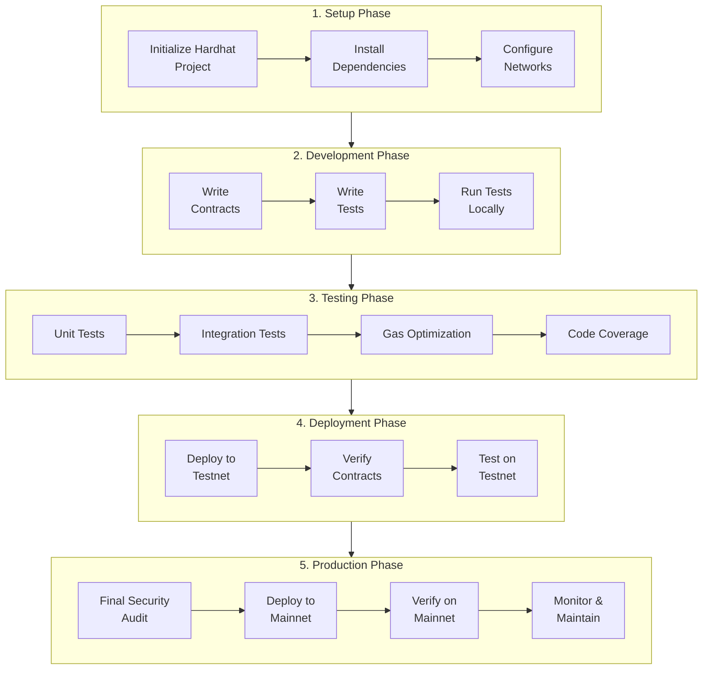

# Intermediate Tutorials

Welcome to WireFluid's intermediate tutorial series! These tutorials build upon the foundational skills you learned in the beginner series, introducing professional development tools and practices essential for production-ready smart contract development.

---

## What You'll Learn

By completing these intermediate tutorials, you'll master:

- Professional command-line development with Hardhat v3
- Modern contract deployment using Hardhat Ignition
- Writing comprehensive automated tests
- Building and deploying NFT collections (ERC-721)
- Verifying contracts on WireScan block explorer
- Following industry-standard development workflows

---

## Learning Path

These tutorials are designed to be completed sequentially, with each building on previous concepts:

```
Prerequisites: Complete Beginner Tutorials
    ↓
1️⃣ Deploy ERC-20 with Hardhat (~10 min)
    ↓
2️⃣ Deploy ERC-721 NFT Contract (~15 min)
    ↓
3️⃣ Testing Smart Contracts (~35 min)
    ↓
4️⃣ Contract Verification (~5 min)
    ↓
Ready for Advanced Topics!
```

---

## Who Are These Tutorials For?

**Perfect if you:**

- Completed the [Beginner Tutorial series](/tutorials-examples/beginner-tutorials)
- Understand Remix IDE basics
- Want to transition to professional development tools
- Plan to build production applications
- Need to implement proper testing and verification

**Prerequisites:**

- Completed [Beginner Tutorials](/tutorials-examples/beginner-tutorials) or equivalent knowledge
- Basic understanding of JavaScript/TypeScript
- [Node.js v18+](/developer-guide/prerequisites/install-nodejs) installed
- MetaMask configured for WireFluid testnet
- Testnet $WIRE tokens from [faucet](https://faucet.wirefluid.com)

---

## Tutorial Overview

### 1. Deploy ERC-20 with Hardhat

> **Time:** ~10 minutes  
> **Tools:** Hardhat v3, Node.js, Terminal

**What you'll build:** A professional ERC-20 token deployment pipeline using command-line tools.

**What you'll learn:**

- Setting up a modern Hardhat v3 project
- Using OpenZeppelin contracts in CLI environment
- Deploying contracts with Hardhat Ignition
- Configuring network connections and private keys
- Managing environment variables securely
- Verifying deployments on WireScan

**Key concepts:**

- Transition from browser-based to CLI development
- Professional project structure
- Environment configuration
- Deployment automation

**Prerequisites:**

- [Node.js installed](/developer-guide/prerequisites/install-nodejs)
- Basic terminal/command line knowledge
- Understanding of ERC-20 tokens

**[Start Tutorial →](/tutorials-examples/intermediate-tutorials/deploy-erc20)**

---

### 2. Deploy ERC-721 NFT Contract

> **Time:** ~15 minutes  
> **Tools:** Hardhat v3, IPFS (optional)

**What you'll build:** A NFT collection with minting capabilities.

**What you'll learn:**

- Understanding ERC-721 NFT standards
- Implementing token minting functionality
- Managing token metadata and URIs
- Setting up collection parameters
- Deploying NFT contracts to WireFluid
- Minting and managing NFTs

**Key concepts:**

- NFT smart contract
- Environment configuration
- Deployment automation

**Prerequisites:**

- Understanding of token standards
- Hardhat environment setup

**[Start Tutorial →](/tutorials-examples/intermediate-tutorials/deploy-erc721)**

---

### 3. Testing Smart Contracts

> **Time:** ~35 minutes  
> **Tools:** Hardhat v3, Mocha, Chai

**What you'll learn:**

- Why testing is critical for smart contracts
- Writing unit tests with Mocha and Chai
- Testing contract deployment and initialization
- Testing token transfers and balances
- Testing access control and permissions
- Handling errors and edge cases
- Measuring code coverage
- Testing events and state changes
- Best practices for smart contract testing

**Key concepts:**

- Test-driven development for blockchain
- Automated testing workflows
- Code coverage analysis
- Error and edge case handling

**Real-world importance:**

- Prevent costly bugs before deployment
- Build confidence in contract behavior
- Create regression test suites
- Industry-standard development practice

**Prerequisites:**

- [Deploy ERC-20 with Hardhat](/tutorials-examples/intermediate-tutorials/deploy-erc20)
- Basic JavaScript/TypeScript knowledge
- Understanding of assertions

**[Start Tutorial →](/tutorials-examples/intermediate-tutorials/testing-smart-contracts)**

---

### 4. Contract Verification

> **Time:** ~20 minutes  
> **Tools:** WireScan, Hardhat verify plugin

**What you'll learn:**

- Why contract verification matters
- Verifying contracts on WireScan block explorer
- Using Hardhat's verification plugin
- Handling verification errors
- Making source code publicly available
- Enabling direct contract interaction

**Key concepts:**

- Blockchain transparency
- Source code verification
- Public auditability
- Trust and security

**Benefits:**

- Users can read your contract source code
- Enable direct interaction via block explorer
- Build trust with your community
- Industry best practice for transparency

**Prerequisites:**

- [Deploy ERC-20 with Hardhat](/tutorials-examples/intermediate-tutorials/deploy-erc20)
- Deployed contract on testnet
- WireScan API key (optional)

**[Start Tutorial →](/tutorials-examples/intermediate-tutorials/contract-verification)**

---

## Development Workflow

### Professional Development Cycle



---

## Best Practices

### Project Organization

```
my-project/
├── contracts/          # Solidity source files
├── ignition/
│   └── modules/       # Deployment modules
├── test/              # Test files
├── scripts/           # Utility scripts
├── .env               # Environment variables (gitignored)
├── .gitignore         # Git ignore file
├── hardhat.config.ts  # Hardhat configuration
├── package.json       # Dependencies
└── README.md          # Documentation
```

### Security Checklist

**Before deploying to mainnet:**

- All tests passing
- Code coverage above 90%
- Security audit completed
- Tested on testnet extensively
- Gas costs optimized
- Access controls verified
- Emergency pause mechanism tested
- Upgrade path considered
- Documentation complete

---

## Frequently Asked Questions

### Do I need to know TypeScript?

Not necessarily, but it helps. Hardhat v3 uses TypeScript by default, but if you know JavaScript, you'll be fine. TypeScript provides better development experience with autocomplete and type checking.

### Can I still use Remix after learning Hardhat?

Absolutely! Remix is still excellent for quick prototyping and learning. Many developers use both: Remix for experiments and Hardhat for serious projects.

### How long does it take to learn Hardhat?

If you've completed the beginner tutorials, you can be productive with Hardhat in a few hours. Full mastery comes with practice over several projects.

### Is Hardhat only for Ethereum?

No! Hardhat works with any EVM-compatible blockchain, including WireFluid, Polygon, BSC, Avalanche, and many others.

### Do I need to write tests?

For production code, absolutely yes. Tests are not optional for serious development. They prevent bugs that could cost real money.

---

## Tutorial Completion Checklist

Track your progress through the intermediate series:

<label> **Prerequisites**</label>  
 <input type="checkbox" id="beginner-complete" /> <label> Beginner tutorials completed</label>  
 <input type="checkbox" id="nodejs" /> <label> Node.js v18+ installed</label>  
 <input type="checkbox" id="editor" /> <label> Code editor ready (VS Code recommended)</label>  
 <input type="checkbox" id="terminal" /> <label> Comfortable with terminal / CLI</label>

<label> **Tutorial 1: Deploy ERC-20 with Hardhat**</label>  
 <input type="checkbox" id="hardhat-init" /> <label> Hardhat project initialized</label>  
 <input type="checkbox" id="erc20-created" /> <label> ERC-20 contract created</label>  
 <input type="checkbox" id="ignition-deploy" /> <label> Contract deployed using Hardhat Ignition</label>  
 <input type="checkbox" id="erc20-verified" /> <label> Contract verified on WireScan</label>

<label> **Tutorial 2: Deploy ERC-721 NFT Contract**</label>  
 <input type="checkbox" id="erc721-created" /> <label> ERC-721 NFT contract created</label>  
 <input type="checkbox" id="nft-deployed" /> <label> NFT collection deployed on testnet</label>  
 <input type="checkbox" id="nft-minted" /> <label> NFTs minted successfully</label>  
 <input type="checkbox" id="metadata-set" /> <label> NFT metadata configured</label>

<label> **Tutorial 3: Testing Smart Contracts**</label>  
 <input type="checkbox" id="test-setup" /> <label> Testing environment configured</label>  
 <input type="checkbox" id="tests-written" /> <label> Test cases written for contracts</label>  
 <input type="checkbox" id="tests-passing" /> <label> All tests passing successfully</label>  
 <input type="checkbox" id="edge-cases" /> <label> Edge cases tested</label>

<label> **Tutorial 4: Contract Verification**</label>  
 <input type="checkbox" id="verify-contract" /> <label> Contract verified on WireScan</label>  
 <input type="checkbox" id="source-visible" /> <label> Source code publicly readable</label>  
 <input type="checkbox" id="explorer-interaction" /> <label> Contract interaction enabled via explorer</label>

**All done?** Congratulations! You're now ready for advanced blockchain development!

---

## Development Tips

### Command Line Basics

```bash
# Create new directory
mkdir my-project && cd my-project

# Initialize Hardhat
npx hardhat init

# Install dependencies
npm install @openzeppelin/contracts

# Compile contracts
npx hardhat compile

# Run tests
npx hardhat test

# Deploy to testnet
npx hardhat ignition deploy ignition/modules/MyContract.ts --network wirefluidTestnet
```

### Useful Hardhat Commands

```bash
# Clean build artifacts
npx hardhat clean

# Get help
npx hardhat help

# List available tasks
npx hardhat

# Check Hardhat version
npx hardhat --version

# Run specific test file
npx hardhat test test/MyContract.test.ts

# Get test coverage
npx hardhat coverage
```

---

## Troubleshooting

### Common Issues

**"Module not found" errors:**

```bash
# Clear and reinstall
rm -rf node_modules package-lock.json
npm install
```

**Compilation errors:**

```bash
# Clear cache
npx hardhat clean
npx hardhat compile
```

**Network connection issues:**

```bash
# Verify .env configuration
# Check RPC URL is correct
# Ensure private key is properly formatted (starts with 0x)
```

**Insufficient funds:**

- Get testnet tokens from [WireFluid Faucet](https://faucet.wirefluid.com)
- Check wallet balance on [WireScan](https://wirefluidscan.com)

---

## Ready to Start?

Choose your learning path:

**Option 1: Sequential Learning (Recommended)**
Start with Tutorial #1 and progress through each:

- [Deploy ERC-20 with Hardhat →](/tutorials-examples/intermediate-tutorials/deploy-erc20)

**Option 2: Specific Interest**
Jump to what you need most:

- [Deploy ERC-721 NFT →](/tutorials-examples/intermediate-tutorials/deploy-erc721)
- [Testing Smart Contracts →](/tutorials-examples/intermediate-tutorials/testing-smart-contracts)
- [Contract Verification →](/tutorials-examples/intermediate-tutorials/contract-verification)

**Option 3: Review Basics First**
Need a refresher?

- [Back to Beginner Tutorials →](/tutorials-examples/beginner-tutorials)

---

**Level up your WireFluid development skills!**
